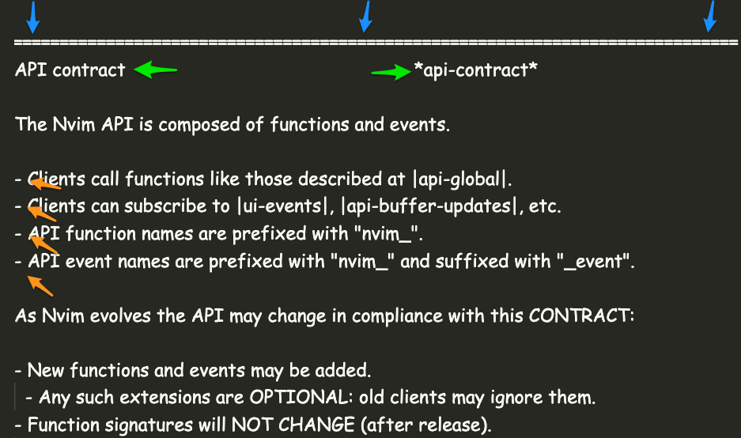

# My First Hack

## The Boilerplate

Astro CLI documentation starter


<div class="notes">
Why Astro?

- the boilerplate
  - built-in light/dark theming
  - sidebar heading aggregation from markdown
  - algolia docsearch done with just config
- interactivity eventually?
</div>

## Regex


<div class="notes">
The plural of "regex" is "regrets".

combination of whole file regex and line based regex parsing

</div>

## Examples (txt)


## Examples (annotated)



## Example 1 (sections)

```javascript
const SECTION_SPLITTER = "---SECTION_SPLITTER---";

// convert split sections to explicit string from regex
let scrubbedContent = textContent.replace(
  new RegExp("^[=,-]+$", "gm"),
  SECTION_SPLITTER
);

const rawSections = scrubbedContent
  .split(SECTION_SPLITTER)
  .map((section) => scrubContent(section.trim()));
```

## Example 2 (section titles)

```typescript
const TITLE_SPLITTER = "---TITLE_SPLITTER---";
const sections: HelpSection[] = rawSections.map((section, index) => {
  const lines: string[] = section.split("\n");

  const [firstLine, ...otherLines] = lines;

  const scrubbedFirstLine = firstLine.replace(
    new RegExp("\\s{2,}", "gm"),
    TITLE_SPLITTER
  );

  const [title, rawAnchor] = scrubbedFirstLine.split(TITLE_SPLITTER);
```

## Example 4 (templating)


<div class="notes">
Markdown supports HTML in many flavors:

- Astro (obviously)
- Remark (gatsby, etc)
- Github
</div>

## The Result (light)


## The Result (dark)


## What's the difference between a general practitioner and a specialist?

## One treats what you have, the other thinks you have what they treat.


