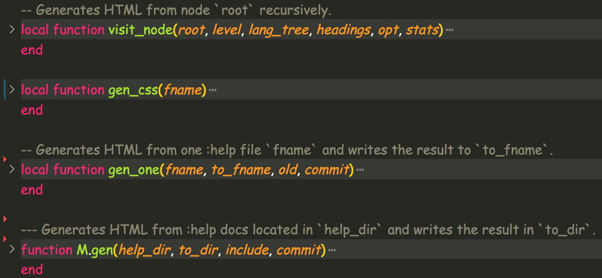
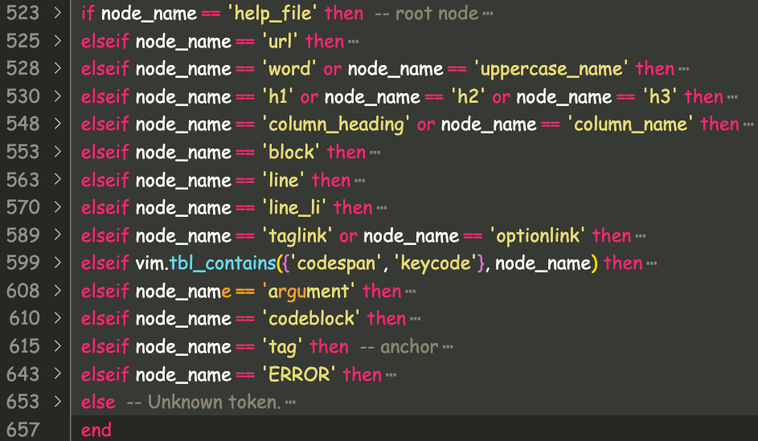
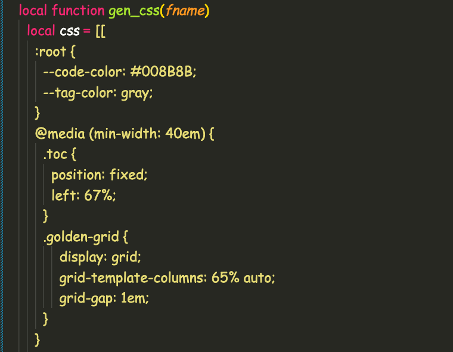
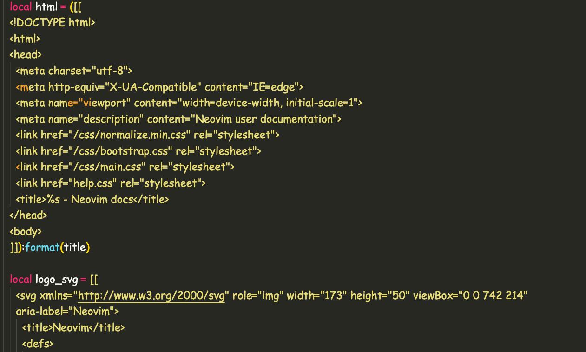
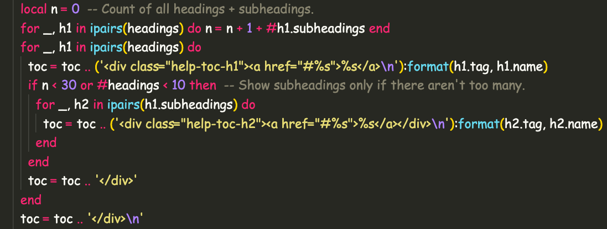

# The Second Hack

<div class="notes">
Teej told me about the treesitter grammar for nvimdoc files.
</div>

## Neovim source: gen_help_html (outline)



## Neovim source: gen_help_html (visit_node)



## Neovim source: gen_help_html (visit_node:codeblock)


## Neovim source: gen_help_html (gen_css)



## Neovim source: gen_help_html (logo, etc)



## Neovim source: gen_help_html (toc)



## Forking neovim (why)

- Reduced repetition in output
- Easier custom theming and light/dark mode

## Forking neovim (example)

Before:

```
elseif node_name == 'argument' then
  return ('%s<code>{%s}</code>'):format(ws(), text)
```

After:

```
elseif node_name == 'argument' then
  return ('%s`{%s}`'):format(ws(), text)
```

## Who is the coolest doctor in the hospital?

## The hip specialist


