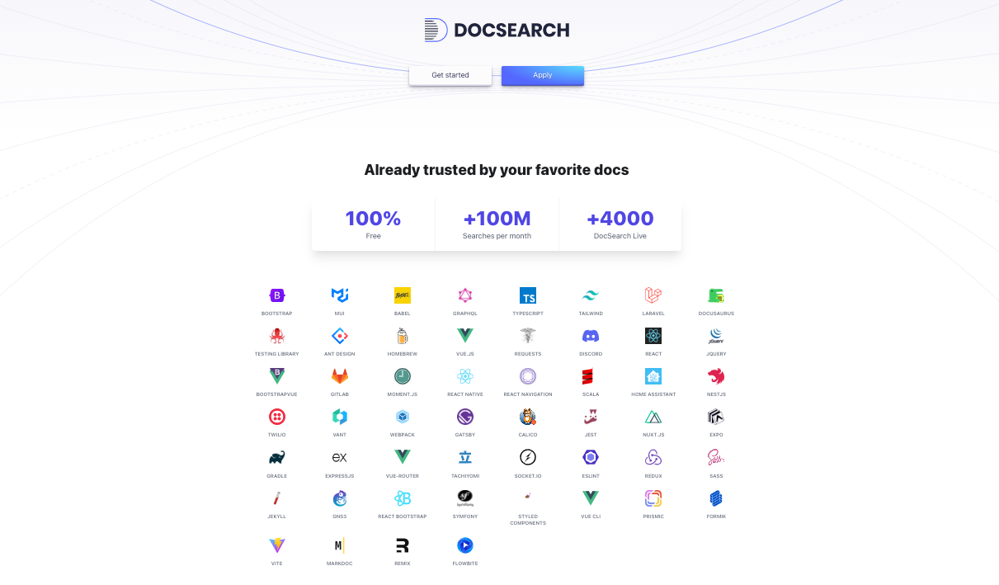

# The Current State

## Rethinking the approach

- No Forking
- Use the existing html output
- Strip repetitive sections

## Why still markdown

Frontmatter

An easy way to embed metadata about the page

Also nice to assign a different layout per page, if we want

## Getting the content

## Modifying the links

Maybe the .html can be added to the pathing/routing to support backwards linkability/compatibility

## Left Sidebar

Still using Regex

## Left Sidebar (help.txt)

## Left Sidebar (file names)

## The Result

[https://cmgriffing.github.io/neovim-docs-web/en/](https://cmgriffing.github.io/neovim-docs-web/en/)

## Thanks to Algolia

[Docsearch()] is free for open source projects

## Why did Dracula go to the doctor?

## He couldn’t stop coffin!

